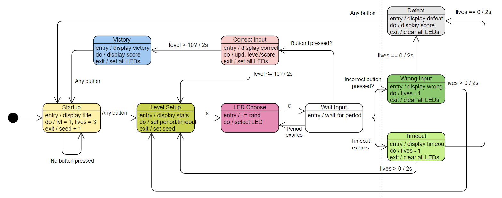
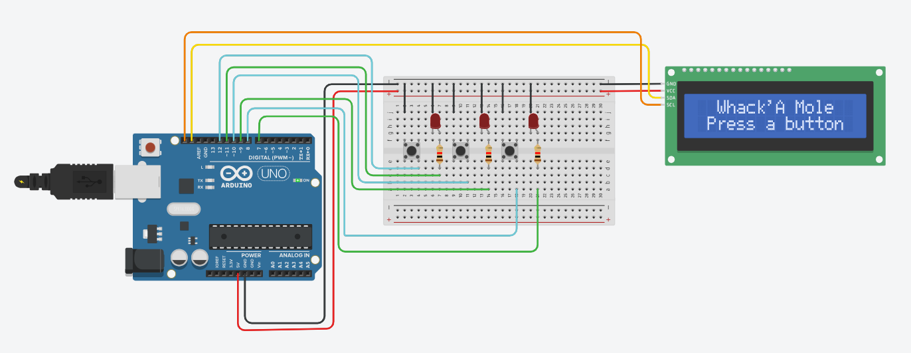

# Whack'A Mole
## A simple prototype using Arduino in Tinkercad of the Whack'A Mole game for teaching purposes.

## State Machine

The game was modeled using a finite state machine (FSM), being a simple project:

## Tinkercad

The prototype can be accessed in the Tinkercad platform, via the [link](https://www.tinkercad.com/things/5n8zzrWSGsh-whacka-mole?sharecode=1GVzapybYDr3rdee4ZZ6P28nAFgrFoDXLqZ8shWPUU0).

